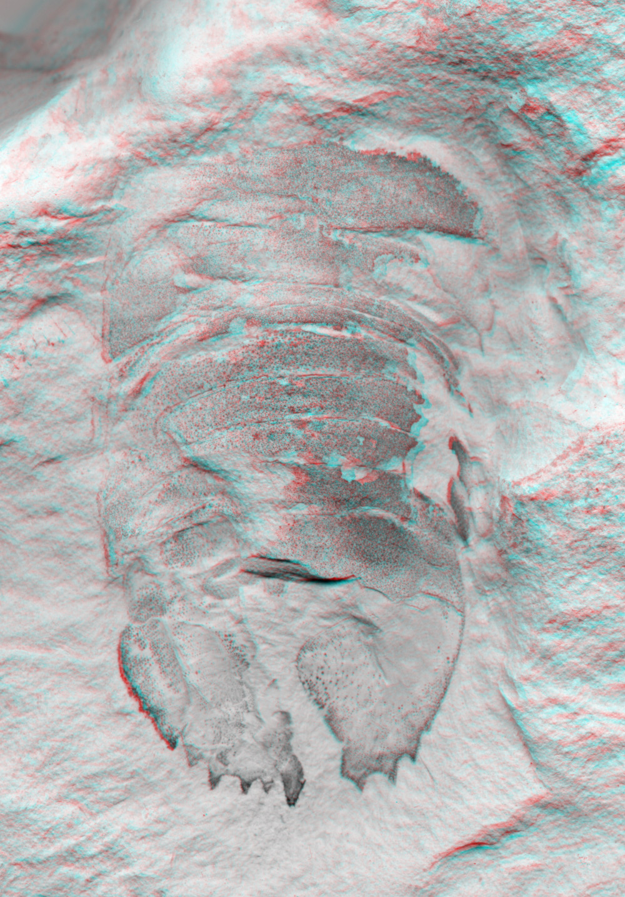
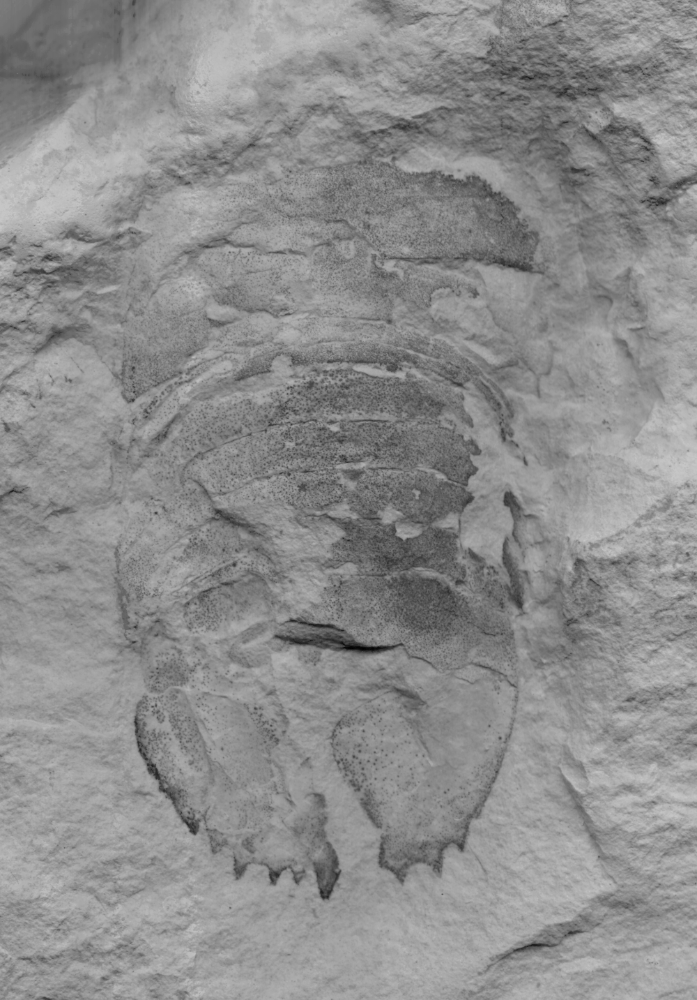

# kataglyph
#### A simple command line tool to convert red-cyan stereo anaglyphs into wiggle images.

Stereo anaglyphs are often used for displaying three-dimensional objects in scientific publications. The most commonly applied anaglyphs are red-cyan stereo anaglyphs. These can be viewed with cheap and well available glasses ([Wikipedia: Anaglyph 3D](https://en.wikipedia.org/wiki/Anaglyph_3D)). However some people have problems perceiving the stereo effects (e.g. one eye is blinded) or the glasses might not be at hand.
The two images that make up the stereo image can be easily retrieved from the stereo file by deleting the red-channel respectively both the green and the blue channel. The resulting image pair can then be used for cross-eye viewing ([Wikipedia: Freeviewing](https://en.wikipedia.org/wiki/Stereoscopy#Freeviewing)). However, cross eye vision needs practice and does not work for all people. The free command line program **kataglyph** solves this problem by creating wiggle images ([Wikipedia: Wiggle stereoscopy](https://en.wikipedia.org/wiki/Wiggle_stereoscopy)) directly from stereo anaglyphs.


  |  
:-------------------------:|:-------------------------:
Input image (re-cyan stereo anaglyph)  |  Output image (animated GIF)


## Usage
**kataglyph** requires the python libraries skimage, numpy, os, imageio, click and funcy. These libraries can be installed via pip or conda.

**kataglyph** requires a path to the input image (argument `-i`). The name of the output file can be specified with the argument `-o` -  otherwise it will default to `output.gif`. **kataglyph** can handle various input image formats such as `.jpg`, `.tif` and `.png`. For some `.tif` images (e.g. those with LZW compression) additional image codecs might have to be installed first: `pip install imagecodecs-lite`.

```python
python kataglyph.py -i /path/to/file.jpg -o danica_test_cli.gif
```

The speed of the animation can optionally be adjusted with the argument `-f`. The unit for this is frames per second (fps). The default value is 4 fps.

```python
python kataglyph.py -i /path/to/file.jpg -o danica_test_cli.gif -v -f 2
```

A help file with more instructions is available by the Command

```python
python kataglyph.py --help
```

## License
The progamm is free and open software (GNU GPL license Version 3).

